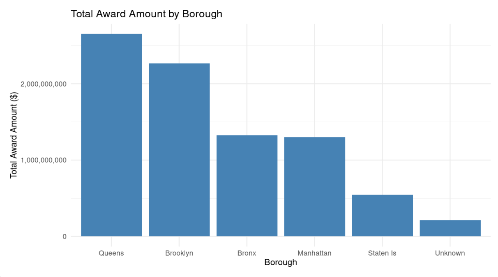
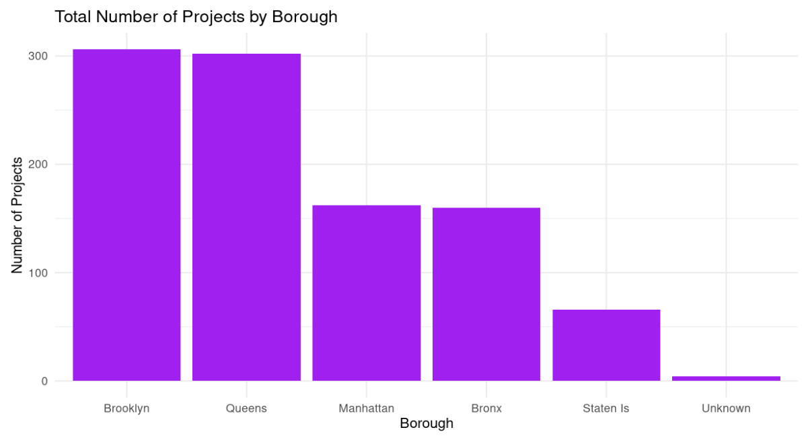
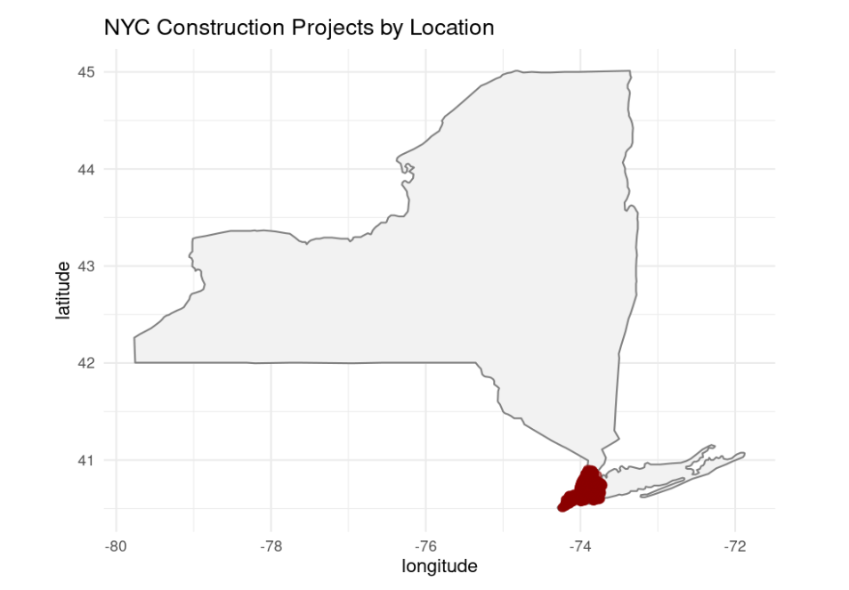

# Data4Justice_project
This project is part of Data4Justice Accelarator Program

# NYC Construction Projects — Data Cleaning & Validation

This project contains a cleaned and validated version of the **Active Projects Under Construction** dataset from [NYC Open Data](https://data.cityofnewyork.us/).

## Dataset

- **File**: `cleaned_nyc_construction.csv`  
- **Rows**: 1000  
- **Columns**: 25 (after renaming and cleaning)

Module : 4
## Cleaning Steps

The dataset was processed in R following best practices in data cleaning and validation. Key steps:

1. **Loaded JSON data** from NYC Open Data using `jsonlite`
2. **Converted data types**: `award`, `latitude`, `longitude` to numeric
3. **Removed duplicates** to ensure unique rows
4. **Cleaned messy text fields** (trimmed whitespace, corrected casing)
5. **Renamed confusing variables** for clarity (e.g., `projdesc` → `project_description`)
6. **Handled missing values** in `zip_code`, `borough`, and ID fields
7. **Validated data** by:
   - Filtering out projects with unrealistic award values
   - Ensuring latitude and longitude fall within NYC bounds
8. **Saved cleaned output** as a CSV file

## Tools & Libraries Used

- **R** (v4.0+)
- **Packages**:
  - `dplyr`
  - `tidyr`
  - `jsonlite`
  - `stringr`
  - `janitor`
  - `ggplot2` (optional for visualization)

## Notes

- Column `project_description` was intentionally left unprocessed for future qualitative analysis.
- Columns like `location_1`, `computed_region_*` were renamed for readability.
- Final dataset is ready for analysis, mapping, or integration into dashboards.

Module 5:
## Questions Explored

1. **What is the average award amount for each borough?**  
2. **What is the total award amount for each borough?**  
3. **What is the total number of projects for each borough?**

## 📈 Key Findings

- Boroughs differ widely in both the **number of projects** and **total award amounts**.
- Some boroughs (like Manhattan) may receive **larger average awards** despite fewer projects.
- Construction types vary, with **CIP** being the most common across all boroughs.

## Visualizations

This section presents visual summaries of key insights from the NYC construction project data. The plots below help visualize disparities in funding, project distribution, and award size across boroughs.

### 1. Total Award Amount by Borough  

---

### 2. Total Number of Projects by Borough  

---

### 4. Award Distribution Histogram  

---

### 5. constraction location 

6. Median Household Income by Census Tract (ACS 2020)

NLP Analysis of Project Descriptions

Goal: Identify the most frequently mentioned types of work in Capacity and CIP projects.

Pipeline: Tokenize → lowercase → remove stop words/punctuation → lemmatize → reassemble → build bigrams and trigrams → count frequencies.

Key Findings:

Unigrams (CIP): ipdvs, exterior, installation, masonry, roof, upgrade, parapet, replacement, system.

Bigrams (CIP): exterior masonry, ipdvs installation, flood elimination, roof parapet, ipdvs camera, path travel, camera installation, climate control.

Trigrams (CIP): parapet exterior masonry, ipdvs camera installation, roof parapet exterior, planyc climate control, planyc boiler conversion, low voltage electrical.

7. Most Frequent Unigrams in Project Descriptions

8. Most Frequent Bigrams in Project Descriptions

9. Most Frequent Trigrams in Project Descriptions

10. Word Cloud of Most Frequent Terms

